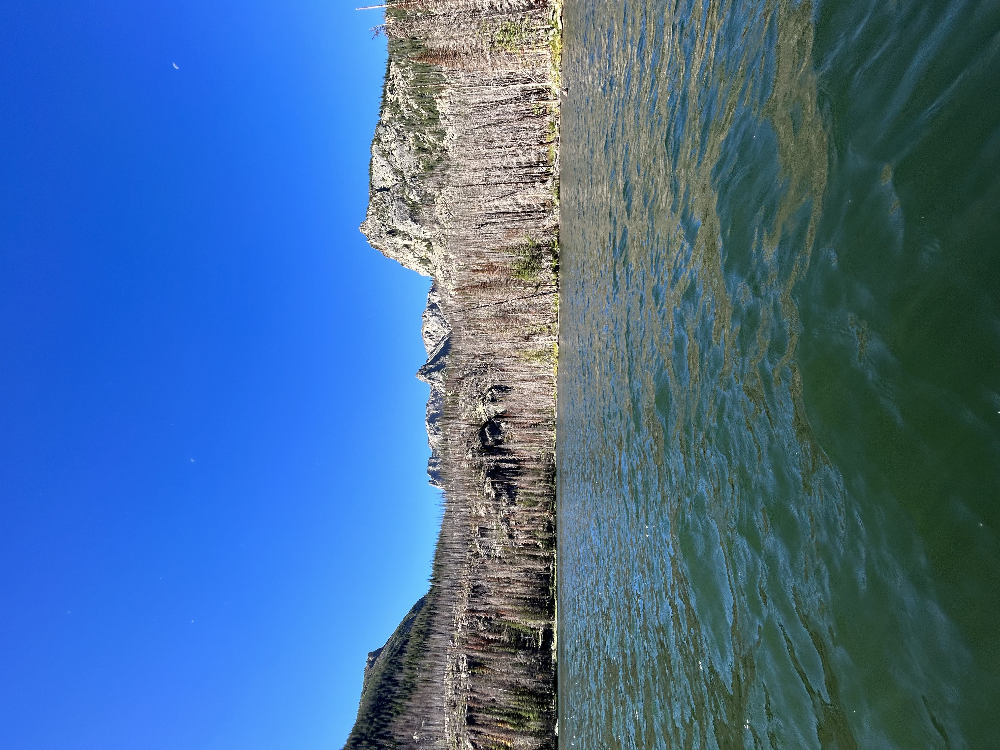
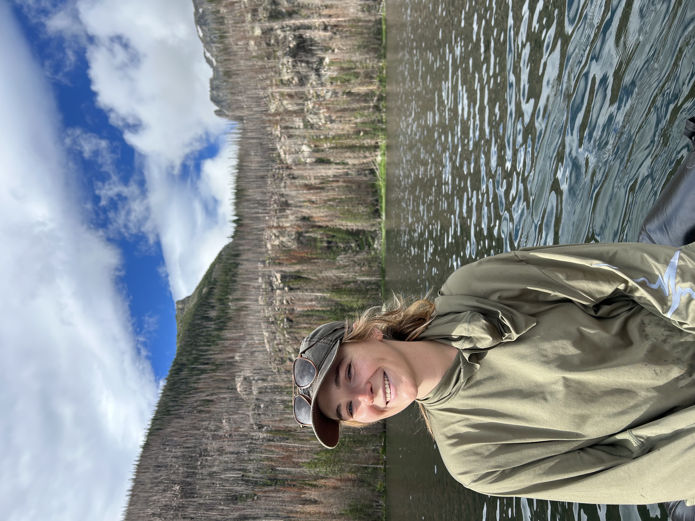
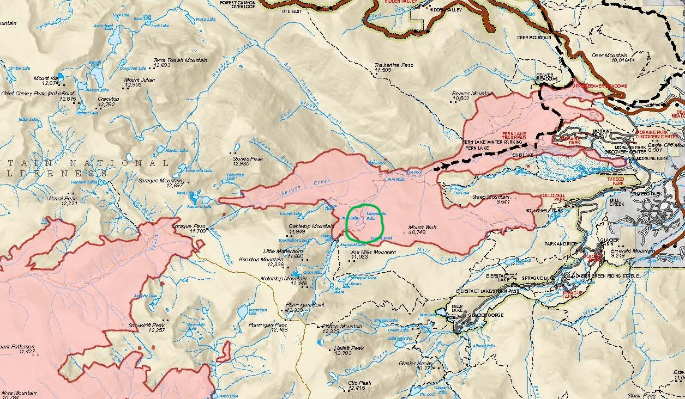

```{r setup, include=FALSE}
knitr::opts_chunk$set(echo = TRUE)
```


# Background: Fern Lake

### Fern Lake is an alpine lake that lies within the boundary of Rocky Mountain National Park. It has been known to be affected by two recent wildfires, one of small size in 2012, and one of significant size in 2020, the East Troublesome fire. The East Troublesome fire was started near Troublesome Pass, CO and grew to a size of 193,812 acres in less than 2 months. The fire is the second largest in Colorado state history. 

### As a student within the Graduate Degree Program in Ecology, part of my degree requirements include working on ecological research under an advisor affiliated with the university. My advisor, Dr. Jill Baron, was tasked by the National Park Service to understand the impacts of the East Troublesome fire on Fern Lake. I will be assisting her with this research. We have received preliminary data recently from Fern Lake sampling conducted over the past three years. Sampling frequency was limited due to funding, so the statistical significance of our findings is somewhat limited as a result. However, we can still use this information to understand some of the fundamental direct impacts of the fire on Fern Lake. 

### Samples were collected from three locations within the lake. The lake outlet, center lake surface, and center lake hypolimnion (deep water, aphotic and often anoxic). 

## Fern Lake:



### Photo Source: Mollie Hendry

## Photo of me collecting lake samples on a raft:



### Photo Source: Mollie Hendry

## Burned forest surrounding Fern Lake:


### Photo Source: Mollie Hendry


## Fern Lake within the East Troublesome Fire Burn Area (pictured within the green circle):



Photo source: USFS


```{r, echo=FALSE}
library(tidyverse)
library(lubridate)
library(viridis)
library(viridisLite)

data <- read.csv("fern.csv")

data$date <- mdy(data$date)

fern <- data %>%
  filter(lake == "fern", location == c("hypo", "outlet", "surface"))

```


# Plotting metric changes over time by location

## Dissolved Organic Nitrogen:

```{r, echo=FALSE}

ggplot(fern, aes(x = date, y = DON)) +
  geom_point() +
  scale_color_viridis() +
  facet_wrap(~location, scales = "free")+
  geom_smooth(method = "lm", se = FALSE, color = "blue")

```

### Dissolved organic nitrogen decreased at all locations post-fire. 

## Conductivity

```{r, echo=FALSE}
ggplot(fern, aes(x = date, y = cond)) +
  geom_point() +
  scale_color_viridis() +
  facet_wrap(~location, scales = "free")+
  geom_smooth(method = "lm", se = FALSE, color = "blue")
```

### Conductivity decreased at the outlet and increased in the hypolimnion and surface post-fire. 

## pH

```{r, echo=FALSE}
ggplot(fern, aes(x = date, y = pH)) +
  geom_point() +
  scale_color_viridis() +
  facet_wrap(~location, scales = "free")+
  geom_smooth(method = "lm", se = FALSE, color = "blue")
```

### pH levels increased at the hypolimnion and surface, and decreased at the outlet post-fire. 

## Calcium

```{r, echo=FALSE}
ggplot(fern, aes(x = date, y = Ca)) +
  geom_point() +
  scale_color_viridis() +
  facet_wrap(~location, scales = "free")+
  geom_smooth(method = "lm", se = FALSE, color = "blue")
```

### Calcium levels increased at the surface and hypolimnion, and decreased at the outlet post-fire. 

## Magnesium

```{r, echo=FALSE}
ggplot(fern, aes(x = date, y = Mg)) +
  geom_point() +
  scale_color_viridis() +
  facet_wrap(~location, scales = "free")+
  geom_smooth(method = "lm", se = FALSE, color = "blue")
```

### Magnesium levels increased at the hypolimnion and surface, and decreased at the outlet post-fire. 

## Sodium

```{r, echo=FALSE}
ggplot(fern, aes(x = date, y = Na)) +
  geom_point() +
  scale_color_viridis() +
  facet_wrap(~location, scales = "free")+
  geom_smooth(method = "lm", se = FALSE, color = "blue")
```

### Sodium levels decreased post-fire at all sampling locations. 

## Potassium

```{r, echo=FALSE}
ggplot(fern, aes(x = date, y = K)) +
  geom_point() +
  scale_color_viridis() +
  facet_wrap(~location, scales = "free")+
  geom_smooth(method = "lm", se = FALSE, color = "blue")
```

### Potassium levels decreased at the hypolimnion and outlet, and increased at the surface post-fire. 

## Ammonium

```{r, echo=FALSE}
ggplot(fern, aes(x = date, y = NH4)) +
  geom_point() +
  scale_color_viridis() +
  facet_wrap(~location, scales = "free")+
  geom_smooth(method = "lm", se = FALSE, color = "blue")
```

### Nitrate levels increased at the hypolimnion and outlet, and decreased at the surface post-fire. 

## Sulfate

```{r, echo=FALSE}
ggplot(fern, aes(x = date, y = SO4)) +
  geom_point() +
  scale_color_viridis() +
  facet_wrap(~location, scales = "free")+
  geom_smooth(method = "lm", se = FALSE, color = "blue")
```

### Sulfate levels decreased at all sampling locations. 

## Nitrate

```{r, echo=FALSE}
ggplot(fern, aes(x = date, y = NO3)) +
  geom_point() +
  scale_color_viridis() +
  facet_wrap(~location, scales = "free")+
  geom_smooth(method = "lm", se = FALSE, color = "blue")
```

### Nitrate levels increased at the hypolimnion and surface, and decreased at the outlet post-fire. 

## Phosphate

```{r, echo=FALSE}
ggplot(fern, aes(x = date, y = PO4)) +
  geom_point() +
  scale_color_viridis() +
  facet_wrap(~location, scales = "free")+
  geom_smooth(method = "lm", se = FALSE, color = "blue")
```

### Phosphate levels decreased at all sampling locations post-fire. 

## Dissolved Organic Carbon

```{r, echo=FALSE}
ggplot(fern, aes(x = date, y = DOC)) +
  geom_point() +
  scale_color_viridis() +
  facet_wrap(~location, scales = "free")+
  geom_smooth(method = "lm", se = FALSE, color = "blue")
```

### Dissolved organic carbon levels decreased at all sampling locations post-fire. 


## Total Dissolved Nitrogen

```{r, echo=FALSE}
ggplot(fern, aes(x = date, y = TDN)) +
  geom_point() +
  scale_color_viridis() +
  facet_wrap(~location, scales = "free")+
  geom_smooth(method = "lm", se = FALSE, color = "blue")
```

### Total dissolved nitrogen increased at the hypolimnion and decreased at the outlet and surface post-fire. 


```{r}

```

